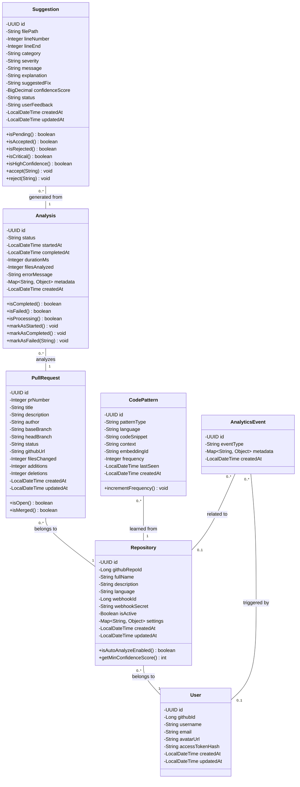

# Backend Model Class Diagram

This document contains a detailed class diagram of the backend models for the CodeSage AI project.

## Class Diagram

## Entity Details

### User
Represents authenticated users from GitHub OAuth.
- **Key Fields**: `githubId` (unique), `accessTokenHash` (securely stored)

### Repository
Represents GitHub repositories being monitored.
- **Key Fields**: `githubRepoId` (unique), `settings` (JSONB for flexibility), `isActive`
- **Relationships**: Belongs to a User.

### PullRequest
Represents GitHub pull requests being analyzed.
- **Key Constraints**: Unique combination of (`repository_id`, `pr_number`)
- **Relationships**: Belongs to a Repository.

### Analysis
Tracks the analysis process for a Pull Request.
- **Lifecycle**: pending -> processing -> completed/failed
- **Relationships**: Link between PullRequest and Suggestions.

### Suggestion
AI-generated code review suggestions.
- **Key Fields**: `confidenceScore`, `severity`, `status` (pending/accepted/rejected)
- **Relationships**: Belong to an Analysis.

### CodePattern
Stores learned patterns from approved PRs for RAG (Retrieval-Augmented Generation).
- **Key Fields**: `embeddingId` (for vector search), `codeSnippet`
- **Relationships**: Linked to a Repository.

### AnalyticsEvent
Generic event tracking for analytics and metrics.
- **Key Fields**: `eventType`, `metadata` (JSONB)
- **Relationships**: Can be linked to User and/or Repository (nullable).
